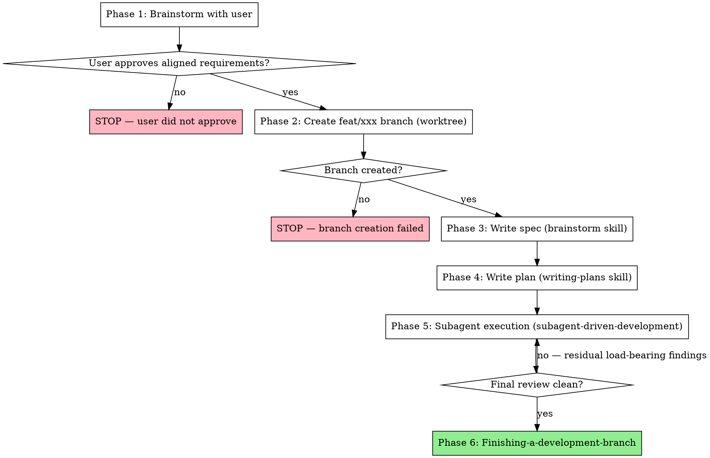

# Auto Superpowers

Drive the full superpowers pipeline (brainstorm → branch → spec → plan → subagent execution → finish) with **a single user checkpoint at the start**. After the user approves the aligned requirements, proceed without pausing until the branch is finished or a true blocker is reached.

**REQUIRED BACKGROUND:** You MUST understand `superpowers:using-superpowers`, `superpowers:brainstorming`, `superpowers:writing-plans`, `superpowers:using-git-worktrees`, `superpowers:subagent-driven-development`, and `superpowers:finishing-a-development-branch` before using this skill. This skill orchestrates them; it does not redefine them.

## When to Use

- User says "auto", "自动化", "全自动", "一键跑完 superpowers", or asks to skip the spec/plan review gates
- User explicitly names this skill with `/auto-superpowers`
- User wants the superpowers discipline but only wants to be interrupted once (for alignment)

## When NOT to Use

- Task is trivial enough that brainstorming/spec is overkill — go straight to TDD
- User wants to drive each step themselves — use the individual superpowers skills
- Spec or plan requires human policy judgment the AI cannot make (legal, business, security review) — confirm before proceeding past brainstorming
- Repository has no git history or no remote — branch creation will fail; surface this to the user before Phase 2

## The Pipeline (in order)



## Phase 1 — Brainstorm (the only checkpoint)

Invoke `superpowers:brainstorming`. Follow it exactly: explore project context, ask questions one at a time, present the design, write the spec doc, self-review it.

**Stop here. Present the aligned requirements to the user.** This is the *only* phase where confirmation is required.

Ask explicitly:
> "Requirements aligned. Spec draft is at `<path>`. Approve to proceed with auto-mode (create `feat/xxx` branch → write plan → subagent execution → finish, no further checkpoints)?"

- **If approved** → continue to Phase 2 immediately, do not wait.
- **If changes requested** → revise the spec, ask again.
- **If declined** → stop. Do not run the rest of the pipeline.

**Critical:** This is the gate. Do not skip it. Do not ask the user to review the spec file path or any intermediate artifact — they will see the result, not the docs, in auto-mode.

## Phase 2 — Create Feature Branch (auto-advance)

The user has approved. Before any plan or spec code lands, isolate the work on a dedicated branch.

**Branch naming:** `feat/<kebab-case-slug>` derived from the user's task. Examples:
- "添加用户登录" → `feat/user-login`
- "重构算法可视化" → `feat/algorithm-visualizer-refactor`

**How to create it:**

1. Invoke `superpowers:using-git-worktrees`.
2. Base branch = the current default branch (usually `main` or `master`). Verify with `git symbolic-ref refs/remotes/origin/HEAD` or `git remote show origin` if uncertain.
3. Branch name = `feat/<slug>` (kebab-case, lowercase, no spaces, ASCII letters/digits/hyphens only).
4. The worktree's directory is your working area for Phases 3–6. Stay in it.
5. Push the empty branch to origin (`git push -u origin feat/<slug>`) so the remote has a reference.

**If branch creation fails** (uncommitted changes blocking checkout, dirty state, name conflict, no remote, etc.):

- Surface the failure to the user with the exact error and a recommended fix. Do not silently continue on `main`. This is a structural stop, not a checkpoint.

Do **not** ask the user to name the branch — derive it from the task. Do not ask which base branch — pick the default branch.

## Phase 3 — Write Spec (auto-advance)

Continue with the spec doc that brainstorming was producing. Commit it to the new branch inside the worktree. Do **not** ask the user to read or approve the spec. Continue to Phase 4.

If the brainstorming skill's spec-writing surfaces a conflict with the original design (e.g., a constraint that contradicts an earlier decision), surface it to the user with both texts side-by-side and wait for resolution — this is a true blocker, not a checkpoint.

## Phase 4 — Write Plan (auto-advance)

Invoke `superpowers:writing-plans`. Produce a detailed implementation plan with tasks, Global Constraints, file paths, and tests. Commit the plan to the branch.

Do **not** ask the user to read or approve the plan. Continue to Phase 5.

If the writing-plans skill surfaces a conflict with the spec, surface it to the user with both texts side-by-side and wait for resolution — this is a true blocker, not a checkpoint.

## Phase 5 — Subagent Execution (auto-advance)

Invoke `superpowers:subagent-driven-development`. Execute every task in the plan using fresh implementer subagents, task reviews, and the final whole-branch review. All commits land on the `feat/<slug>` branch.

Do **not** pause to ask "should I continue?" between tasks. The skill's normal "Continuous execution" rule applies — execute all tasks without stopping.

The only legitimate stop conditions during this phase:

1. **BLOCKED** status from an implementer that the controller cannot resolve (e.g., the plan itself is wrong).
2. **Load-bearing finding at the breaker cap** — adjudication surfaces a structural defect that downstream tasks would inherit.
3. **Spec/plan conflict** discovered mid-execution.

Any of the above → stop and report to user with: blocker description, relevant plan/spec text, and recommended next action.

Do not stop for: progress updates, "looking good so far" summaries, or non-load-bearing parked findings.

## Phase 6 — Finalize (auto-advance)

When the final whole-branch review is clean, invoke `superpowers:finishing-a-development-branch`. Present the branch state to the user.

The final whole-branch review happens inside Phase 5, not here. Phase 6 only handles integration decisions (merge / PR / keep working) — surface them in one message, do not ask serially.

## Rationalization Guards (DO NOT)

| Excuse | Reality |
|--------|---------|
| "Spec looks good, let me show the user before plan" | User asked for auto. Auto means auto. Continue. |
| "Plan is long, let me confirm before dispatching" | Plan is internal artifact. The user will see the result, not the plan. |
| "Task 1 is risky, let me check in" | Task review inside subagent-driven-development is the gate. Trust it. |
| "Final review found minors, let me ask user" | Park with rulings per subagent-driven-development. Continue. |
| "I'll just summarize progress" | Progress summaries are noise in auto-mode. The ledger carries the record. |
| "The user might want to change their mind" | They had the checkpoint. They approved. Honor the approval. |

## Red Flags — STOP and surface to user

- **Phase 1 alignment not approved** — never proceed past brainstorming
- **Spec/plan conflict discovered mid-execution** — present both texts, ask which governs
- **Implementer reports BLOCKED** on a non-mechanical issue (missing info, plan defect)
- **Load-bearing finding at the breaker cap** — structural failure that would propagate
- **Tests fail at the final whole-branch review** — stop, surface failures, ask before continuing

If none of those trigger, **continue silently**. No intermediate confirmation. No progress narration between phases. The ledger and git history carry the record.

## Common Mistakes

| Mistake | Fix |
|---------|-----|
| Asking for confirmation after Phase 1 spec write | Phase 1 alignment *is* the checkpoint. Stop only there. |
| Treating "auto" as "skip brainstorming" | Brainstorming IS the alignment phase. It is included. |
| Letting the implementer subagent inherit session context | subagent-driven-development enforces fresh-context-per-task. Do not paste session history into dispatches. |
| Pausing at final-review residuals | Park minors with rulings per subagent-driven-development. Only stop on load-bearing findings. |
| Re-asking the user after they approved | If they said "go" at the alignment checkpoint, they meant "go all the way". |

## Quick Reference

| Phase | Skill to invoke | User confirmation? |
|-------|----------------|--------------------|
| 1. Brainstorm + alignment | `superpowers:brainstorming` | **YES — only checkpoint** |
| 2. Write plan | `superpowers:writing-plans` | No |
| 3. Execute | `superpowers:subagent-driven-development` | No (only on true blockers) |
| 4. Finalize | `superpowers:finishing-a-development-branch` | No (present options) |

## Invocation

```
/auto-superpowers <task description>
```

The skill reads the task description as the initial prompt for brainstorming. If no task description is given, ask the user what they want to build before invoking Phase 1.