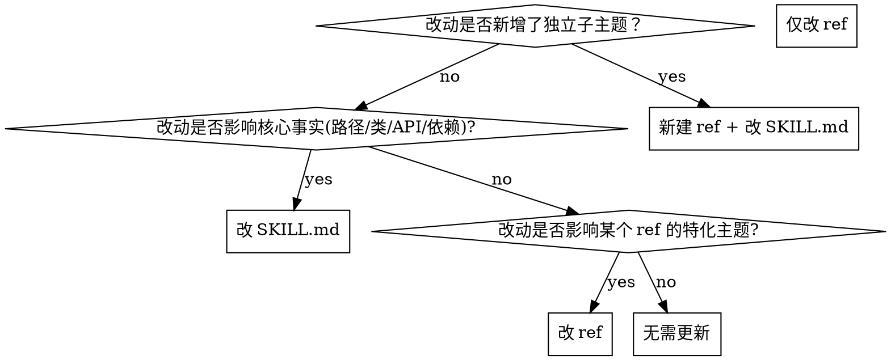

# Post-Feature Skill Sync — 功能开发完成后同步 skill 与 ref

> **定位：** 在功能开发完成（PR / merge / commit 前）这一节点，把代码改动同步到 `.claude/skills/` 下受影响的 skill 与 `references/` 文档。
>
> **与 [[skill-codebase-audit]] 的分工：**
> - **本 ref（post-feature-sync）：** 聚焦「**这一次**功能改了什么」→ 增量同步；时效性强，与提交/合并绑定。
> - **audit ref：** 聚焦「**全量**检查所有 skill 是否仍准确」→ 周期性巡检；不绑定提交。
>
> **何时读取本 ref：**
> - 准备提交一个功能 PR 前
> - 完成一次重构、合并一个特性分支后
> - "skill 是不是过期了？" 出现在 PR review 中
> - 用户说"做完这个功能了，更新下对应的 skill"

---

## 1. 工作流总览

```
1. 列改动 → git diff --name-only
2. 分类   → 按"新增 / 删除 / 重命名 / 签名变 / 新依赖 / 新主题"分类
3. 定位   → grep -rln <路径片段> .claude/skills/ 找出受影响 skill
4. 判定   → 影响 SKILL.md / ref / 两者 / 新建 ref
5. 同步   → 改对应文档
6. 验证   → test -f + grep 确认所有引用仍存在
7. 提交   → 与代码改动同一 PR，或紧随的 chore commit
```

---

## 2. 改动清单模板

每完成一次功能，先把改动文件按下面的清单**逐项分类**。这是后面所有判断的输入。

| 改动类型 | 例子 | 关注字段 |
|---------|------|---------|
| 新增文件 | `src/auth/oauth.py` | skill 是否漏过该模块 |
| 删除文件 | 删 `src/auth/legacy.py` | skill 中的旧路径是否变假引用 |
| 移动/重命名 | `auth/login.py` → `auth/oauth.py` | sed 全局替换 |
| 类/函数改名 | `class UserModel` → `class Account` | sed 全局替换 |
| 函数签名变化 | `def login(user, pwd)` → `def login(req)` | skill 中的示例代码失效 |
| 接口/路由变化 | 新增 `POST /api/v2/login` | 接口表过期 |
| 配置/协议字段 | env 变量改名、JSON 字段调整 | 数据模型清单过期 |
| 新增依赖 | `requirements.txt` 加包 | 工具栈说明过期 |
| 新增子主题 | 引入 OAuth / WebSocket / 报表导出 | 可能需要新建 ref |

### 自动化辅助（可选）

```bash
# 一键列出本次改动涉及的 skill（脚本版）
CHANGED=$(git diff --name-only HEAD~1)
for skill in .claude/skills/*/SKILL.md; do
  refs=$(echo "$CHANGED" | while read f; do
    grep -l "$f" "$skill" 2>/dev/null
  done)
  if [ -n "$refs" ]; then
    echo "受影响的 skill: $skill"
  fi
done
```

---

## 3. 影响范围判定

| 影响范围 | 触发条件 | 操作 |
|---------|---------|------|
| **仅 SKILL.md** | 路径/类名/依赖矩阵等核心事实变了 | `Edit` SKILL.md |
| **仅 references/** | 某个 ref 里的 API 表/示例过时 | `Edit` 对应 ref |
| **两者都改** | 核心事实 + 某个 ref 的特化主题 | `Edit` SKILL.md + ref |
| **新建 ref** | 出现独立的特化子主题 | `Write` 新 ref + SKILL.md 末尾登记 |

### 判定决策树



---

## 4. 同步操作清单

### 4.1 路径/类名/模块结构变化

```bash
# 全局替换（SKILL.md + 所有 refs）
grep -rln "src/auth/login\.py" .claude/skills/ | xargs sed -i 's|src/auth/login\.py|src/auth/oauth.py|g'

# 类名/函数名同理
grep -rln "class UserModel" .claude/skills/ | xargs sed -i 's|class UserModel|class Account|g'
```

替换后**人工 review** 一遍 diff，确保没误伤其他同名 token（如变量名 `user_model`）。

### 4.2 API/接口/路由变化

找到受影响的 skill 或 ref 中的「接口表」「路由表」：

```markdown
## 接口表

| 方法 | 路径 | 说明 |
|------|------|------|
| POST | /api/v1/login | 旧接口（已废弃，见 [[references/oauth.md]]） |
| POST | /api/v2/login | 当前主用接口（OAuth2）  ← 新增 |
```

同步完成后，回到正反案例的代码示例，**手动跑一遍示例**确认可执行。

### 4.3 新增模块 / 子主题 → 新建 ref

如果本次功能引入了独立的子主题（OAuth、WebSocket、报表导出、第三方集成等）：

```bash
# 1. 创建 ref 文件
touch .claude/skills/<相关 skill>/references/<新主题>.md

# 2. 写入新主题内容（结构参考 [[skill-codebase-audit]] 的目录约定）
```

新 ref 的最小结构：

```markdown
# <主题名>

> **定位：** <该主题在项目中的角色>
> **何时读取：** <触发词 / 场景>
> **依赖：** <前置 skill 或 ref>

## 1. 工作流/协议
...

## 2. API 表
...

## 3. 常见坑
...
```

### 4.4 依赖/工具栈变化

更新 SKILL.md 中描述工具栈/前置条件的小节：

```markdown
## 工具栈
- Python 3.11+
- requests ≥ 2.31（新增）
- pytest 7.x
```

---

## 5. 验证清单（必跑）

```bash
# 1. SKILL.md 中所有路径引用存在
grep -oP '[\w/.\-]+\.[a-z]+' .claude/skills/<skill>/SKILL.md | while read f; do
  [ -f "$f" ] && echo "✅ $f" || echo "❌ $f"
done

# 2. 所有 ref 中的路径引用也存在
for ref in .claude/skills/<skill>/references/*.md; do
  grep -oP '[\w/.\-]+\.[a-z]+' "$ref" | while read f; do
    [ -f "$f" ] && echo "✅ $f (in $ref)" || echo "❌ $f (in $ref)"
  done
done

# 3. 类/函数引用仍存在（按语言）
grep -rn "class Account\|def login_v2" --include="*.py"

# 4. 新 ref 在 SKILL.md 末尾 References 表中已登记
grep "<新主题>" .claude/skills/<skill>/SKILL.md
```

---

## 6. 提交/PR 模板

### 6.1 Commit message 模板

```bash
git add .claude/skills/<skill>/
git commit -m "feat(auth): 新增 OAuth2 登录

- 代码：新增 src/auth/oauth.py, class Account
- skill: 同步 path/auth skill（路径、类名、依赖矩阵）
- skill ref: 新增 references/oauth.md 覆盖新协议
- 验证：所有 grep 引用均通过
"
```

### 6.2 PR 描述必填项

```markdown
## 功能改动
- ...

## Skill 同步
- [ ] 受影响的 skill 列表：<skill-a>, <skill-b>
- [ ] 新建/更新的 ref：references/<x>.md
- [ ] 已运行 `test -f` + grep 验证所有引用
- [ ] References 表已登记新 ref
```

---

## 7. 与场景三（反思同步）的衔接

完成本 ref 描述的「事实层同步」后，**继续**走 SKILL.md 中的「场景三：反思同步」流程，把本次开发中：

- 踩到的坑
- 发现的新模式
- 关键上下文

作为 good_eg / bad_eg 沉淀到对应 skill 或 ref。

两者关系：

| 维度 | 场景四（本 ref） | 场景三 |
|------|----------------|--------|
| 同步什么 | 路径、类名、API、模块结构 | 经验、踩坑、最佳实践 |
| 触发 | 功能代码改动 | skill 使用过程有感悟 |
| 时效 | 必绑 PR/merge | 可异步，可会话内 |
| 谁触发 | 开发者主动 | 任何使用 skill 的 agent |

> **纪律：** 功能 PR 合并前**先走场景四**（事实层同步），**再走场景三**（经验层沉淀）。两者必须同时进入 PR 或紧随的 commit。

---

## 8. 常见坑

| 坑 | 表现 | 预防 |
|----|------|------|
| 路径已迁移但 skill 没改 | `test -f` 返回 ❌ | 改完后用 grep 全局扫一次 |
| 类名改了但 sed 误伤同名变量 | `user_model` 变量被改成 `account` | sed 后 review diff |
| 改了 SKILL.md 但忘了同步 ref | ref 里的旧路径还在 | 同时检查所有引用 `references/*.md` |
| 新建了 ref 但 SKILL.md 末尾 References 表没登记 | 新 ref 无人知晓 | 用 grep 自检 `References` 表 |
| skill 同步和代码改动拆到不同 PR | 过期 skill 留 main 分支 | 同一 PR，或紧随的 chore |
| 只同步 SKILL.md 没同步描述字段 | description 还提到旧模块名 | 同步 frontmatter `description` |
| 改了导入路径但忘了更新示例代码 | skill 里的代码示例运行报错 | 手动跑一次示例 |