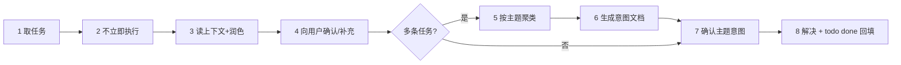

# taskget — 领取任务 · 确认意图 · 再解决

本 skill 服务于**任务队列消费端**：提交方把任务投到 kvcli todo 的某个 `topic`（如 `go` / `docs` / `bug`），你（agent）作为该 topic 的消费者，按下面的流程领任务、对齐意图，最后才动手。关键在中间那几步"确认"——**不确认不动手**，因为任务往往模糊、多条、或覆盖了多个主题，先对齐能避免大段返工。

## 何时触发

- 用户让你"领取/看一下/处理"某个主题的任务
- 用户提到"发布的任务"、任务队列、todo 清单、待办
- 你被分配了 kvcli todo 上的任务，需要消费
- 用户要求"先确认意图再执行"、"把任务聚类成文档"

不确定是否该触发时，倾向触发——这比跳过确认直接开干要安全得多。

## 核心原则（贯穿整个流程,遇到先问用户再动手）

> 以下两条是**必读**的行为准则,覆盖 8 步全流程;遇到相应场景**主动先问用户**再行动,不要沉默地自行处理。

1. **清理 / 覆盖上下文时,先问用户。**
   删除、改写、合并、丢弃任何上下文信息(task 文本、prompt、之前的状态、用户给的背景等)之前,**主动向用户确认**:是要丢弃、改写还是补充?
   沉默的清理 = 信息丢失 + 用户不知情。
2. **先努力在当前目录自己调查需求,彻底理解;确实需要外部支持,再问用户。**
   拿到需求 → **先别问、自己去摸** → 摸不到底再问。问的判断标准是:

   **第一步:自己在当前目录穷尽调查。**翻代码、读文档、读配置、查 git 历史、看相关任务、跑命令验证、读测试、用 grep/find 搜。

   - 当前目录**能回答的,不许问用户**。
   - 不许"凭常识猜默认值"、"还没查就先问"、"查到一半就问"、把能查到的东西推给用户。

   **第二步:确实超出当前目录能力,才问用户。**确认无法在当前目录解决后,告诉用户「**我已经查过 X、Y、Z,缺的是 W**,请提供」——把已查证据一起摆出来。

   - 真的需要外部资源:配置项 / 凭据 / 外部 prompt / 别的项目文件 / 用户主观偏好 / 业务决策,这些才问。

   核心原则:**先自己摸到底,摸不到底再问**;问的时候必须带「我已查过哪里、缺什么」。

   反例:任务说"线上如何访问",直接问"线上地址是?"——正确做法是先看 deploy.yml / docker-compose / README / docs,能推断就推断,推断不出再问并摆已查证据。

## 前置依赖 skill（前置调用）

- **动手前必须调用**：`superpowers:writing-plans`
- 调用时机：**Step 7 确认主题意图之后、Step 8 开始解决之前**。把已确认的意图作为 spec，交给 writing-plans 产出实现计划（存 `docs/superpowers/plans/YYYY-MM-DD-<feature>-indent.md`），**按计划**再开始解决。
- 计划的任务拆分、写法、执行交接都以 `superpowers:writing-plans` 为准，本 skill 不重复编写。

## 核心流程（8 步）



### Step 1 — 取任务：拿你 topic 的全部任务

先确定你的 **topic**：从用户上下文推断（如"go 主题"、"文档任务"）；不确定就问一句。

取你 topic 的**全部任务**（open + done 一起），直接 `--topic` 过滤，**不要自己拉全量再拿 JSON 处理**：

```bash
kvcli todo list --topic <你的topic>            # 表格：该 topic 的待办 + 已完成
kvcli todo list --topic <你的topic> --json     # JSON：{"open":[...],"done":[...]} 机器可读
```

> ⚠️ **禁止** `kvcli todo list --json | python -c "...按 topic 过滤..."` 这套自己过滤的做法——`list --topic` 一步到位。

只取第一条待办时用 `first`：

```bash
kvcli todo first --topic <你的topic> --json   # 带 --topic 时 JSON 含该 topic 的 prompt 字段
```

**同时取回上下文提示词**：`todo:prompt:<topic>` 存着该主题的关键知识/提示词，`first --topic ... --json` 或 `prompt get --topic ... --json` 都能拿到——务必把它读进判断，这是你理解任务的背景。

> 完整命令清单、退出码、避坑见 **[[todo-commands]]**。

### Step 2 — 不要立即执行

拿到任务后**先停下来**。直接开干是这里最常见的错误：任务文本经常是"半句话需求"，盲目执行必然返工。后面几步就是用来把"半句话"补全的。

### Step 3 — 读上下文 + 润色

**探索整个项目 使用subagent ,根据用户的主题 派出一个subagent帮助收集上下文 !!!!!!!!!!!**

- 读该 topic 的提示词（`todo:prompt:<topic>`）
- 读任务文本，把含糊的措辞、缺的信息、明显的错误标出来
- 把每条任务**改写成清晰的表述**（可执行、有边界、可验收），但不改其原意
- 可选: 如果有相关的skill支持 subagent也返回相关的可以作为依据的skill条目

### Step 4 — 向用户确认 & 补充

把润色后的任务清单摆给用户：

- 每条任务确认"你理解得对不对"
- 让用户补充缺失的背景、约束、优先级
- 合并/删除过时任务在这里一并敲定

### Step 5 — 按主题聚类

若有多条任务，按**主题**聚类（如"CLI 重构"、"测试补全"、"文档"各成一簇）。一条任务只属一簇，簇名即主题意图。

### Step 6 — 生成意图文档

把聚类结果写成结构化文档（如 `.claude/repo/_self/<主题>-意图.md` 或 `docs/superpowers/specs/` 下的设计文档）：

- 每个主题：任务列表、目标、上下文/提示词摘要、边界、验收标准
- 文档是 Step 7 确认的载体，也是后续执行的依据

### Step 7 — 确认主题意图

把文档/聚类结果交给用户确认每个主题的意图与优先级。**用户拍板后才算对齐。**

### Step 8 — 开始解决 → **完成r即回填 `todo done`**

确认后，按主题逐簇解决。**每解决完一条，立即回填 `kvcli todo done`**——这是收单闭环的最后一步，漏掉会让任务一直挂在 open 队列：

```bash
kvcli todo done <id> --result "完成结果摘要"   # 移入 done 并写完成结果（note 字段）
```

> - 领取任务时（Step 1 的 `list --topic` / `first --topic`）**记下它的 `<id>`**，回填时用同一个 id。
> - `--result` 写明"做了什么 + 怎么验证"，供下次查阅、也供提交方确认。
> - 同主题多条任务逐条解决、逐条回填，不要攒到最后一次填。

## kvcli 调用参考

| 何时                             | 命令                                                                              |
| -------------------------------- | --------------------------------------------------------------------------------- |
| 取某 topic 全部任务（open+done） | `kvcli todo list --topic <t> [--json]`                                          |
| 取全部任务                       | `kvcli todo list [--json]`                                                      |
| 取 topic 第一条 + 提示词         | `kvcli todo first --topic <t> [--json]`                                         |
| 提交/回填任务                    | `kvcli todo add --topic <t> "文本"` / `kvcli todo done <id> [--result "..."]` |
| 管理 topic 提示词                | `kvcli todo prompt set/get/del --topic <t>`                                     |
| 前置条件                         | 二进制就绪 +`kvcli auth login` + 后端可达（默认 `http://47.110.80.47:8988`）  |

## 错误案例

| 错误操作                                                                 | 实际后果                                         | 正确做法                                                                                                                    |
| ------------------------------------------------------------------------ | ------------------------------------------------ | --------------------------------------------------------------------------------------------------------------------------- |
| 直接动手不先确认意图                                                     | 任务文本常是半句话，盲目执行必返工               | 走 Step 2-4：润色 → 摆给用户确认 → 用户补充                                                                               |
| `kvcli todo list --json` + python 自过滤 topic                         | 每次多写一坨过滤逻辑、易错                       | `kvcli todo list --topic <t>` 一步到位                                                                                    |
| 解决完不`kvcli todo done <id>`                                         | 任务一直挂 open，队列失真、提交方不知完成        | 解决一条立即回填，`--result` 写明结果                                                                                     |
| 回填用错 id / 用 done 列表里的 id                                        | `done` 报 `task id=N not found in todo:open` | 用 Step 1`list --topic` 拿到的 open 里的 id                                                                               |
| 未登录就调 todo 子命令                                                   | 报「未登录」exit 1                               | 先`kvcli auth login`                                                                                                      |
| 沉默清理上下文（丢弃/改写/合并 task 文本、prompt、用户给的背景而不告知） | 信息丢失、用户不知情、回滚困难                   | 删除或改写前主动问用户：丢弃 / 改写 / 补充？                                                                                |
| 需要外部资源就问用户（或凭"常识"猜默认值、推本目录能查到的东西给用户）   | 下游全错、用户反复答重复问题、任务推进慢         | 先在当前目录穷尽调查（代码/文档/配置/git/任务/测试/命令），彻底理解；超出当前目录能力再问，且必须带「我已查过哪里、缺什么」 |

## Ref 加载引导

| ref | 何时读取                                           | 路径                        |
| --- | -------------------------------------------------- | --------------------------- |
| [[todo-commands]]    | 需要执行 kvcli todo 命令、查退出码/数据结构/避坑时 | references/todo-commands.md |

**当且仅当**要敲 kvcli 命令或校验输出时才加载 `[[todo-commands]]`；平时它不进上下文。
