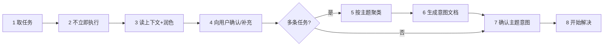

# taskget — 领取任务 · 确认意图 · 再解决

本 skill 服务于**任务队列消费端**：提交方把任务投到 kvcli todo 的某个 `topic`（如 `go` / `docs` / `bug`），你（agent）作为该 topic 的消费者，按下面的流程领任务、对齐意图，最后才动手。关键在中间那几步"确认"——**不确认不动手**，因为任务往往模糊、多条、或覆盖了多个主题，先对齐能避免大段返工。

## 何时触发

- 用户让你"领取/看一下/处理"某个主题的任务
- 用户提到"发布的任务"、任务队列、todo 清单、待办
- 你被分配了 kvcli todo 上的任务，需要消费
- 用户要求"先确认意图再执行"、"把任务聚类成文档"

不确定是否该触发时，倾向触发——这比跳过确认直接开干要安全得多。

## 前置依赖 skill（前置调用）

- **动手前必须调用**：`superpowers:writing-plans`
- 调用时机：**Step 7 确认主题意图之后、Step 8 开始解决之前**。把已确认的意图作为 spec，交给 writing-plans 产出实现计划（存 `docs/superpowers/plans/YYYY-MM-DD-<feature>-indent.md`），**按计划**再开始解决。
- 计划的任务拆分、写法、执行交接都以 `superpowers:writing-plans` 为准，本 skill 不重复编写。

## 核心流程（8 步）



### Step 1 — 取任务：拿你 topic 的全部任务

先确定你的 **topic**：从用户上下文推断（如"go 主题"、"文档任务"）；不确定就问一句。

取全部任务用 `list`（open + done 一起），用 JSON 解析后按你的 topic 过滤：

```bash
kvcli todo list --json | python -c "import sys,json;d=json.load(sys.stdin);print(json.dumps([t for t in d.get('open',[]) if t.get('topic')=='<你的topic>'],ensure_ascii=False,indent=2))"
```

只取第一条待办时用 `first`：

```bash
kvcli todo first --topic <你的topic> --json   # 带 --topic 时 JSON 含该 topic 的 prompt 字段
```

**同时取回上下文提示词**：`todo:prompt:<topic>` 存着该主题的关键知识/提示词，`first --topic ... --json` 或 `prompt get --topic ... --json` 都能拿到——务必把它读进判断，这是你理解任务的背景。

> 完整命令清单、退出码、避坑见 **[[todo-commands]]**。

### Step 2 — 不要立即执行

拿到任务后**先停下来**。直接开干是这里最常见的错误：任务文本经常是"半句话需求"，盲目执行必然返工。后面几步就是用来把"半句话"补全的。

### Step 3 — 读上下文 + 润色

- 读该 topic 的提示词（`todo:prompt:<topic>`）
- 读任务文本，把含糊的措辞、缺的信息、明显的错误标出来
- 把每条任务**改写成清晰的表述**（可执行、有边界、可验收），但不改其原意

### Step 4 — 向用户确认 & 补充

把润色后的任务清单摆给用户：

- 每条任务确认"你理解得对不对"
- 让用户补充缺失的背景、约束、优先级
- 合并/删除过时任务在这里一并敲定

### Step 5 — 按主题聚类

若有多条任务，按**主题**聚类（如"CLI 重构"、"测试补全"、"文档"各成一簇）。一条任务只属一簇，簇名即主题意图。

### Step 6 — 生成意图文档

把聚类结果写成结构化文档（如 `.claude/repo/_self/<主题>-意图.md` 或 `docs/superpowers/specs/` 下的设计文档）：

- 每个主题：任务列表、目标、上下文/提示词摘要、边界、验收标准
- 文档是 Step 7 确认的载体，也是后续执行的依据

### Step 7 — 确认主题意图

把文档/聚类结果交给用户确认每个主题的意图与优先级。**用户拍板后才算对齐。**

### Step 8 — 开始解决

确认后，按主题逐簇解决。解决完一个就用 kvcli 回填：

```bash
kvcli todo done <id> --result "完成结果摘要"
```

## kvcli 调用参考

| 何时                     | 命令                                                                              |
| ------------------------ | --------------------------------------------------------------------------------- |
| 取全部任务（open+done）  | `kvcli todo list [--json]`                                                      |
| 取 topic 第一条 + 提示词 | `kvcli todo first --topic <t> [--json]`                                         |
| 提交/回填任务            | `kvcli todo add --topic <t> "文本"` / `kvcli todo done <id> [--result "..."]` |
| 管理 topic 提示词        | `kvcli todo prompt set/get/del --topic <t>`                                     |
| 前置条件                 | 二进制就绪 +`kvcli auth login` + 后端可达（默认 `http://47.110.80.47:8988`）  |

## Ref 加载引导

| ref | 何时读取                                           | 路径                        |
| --- | -------------------------------------------------- | --------------------------- |
| [[todo-commands]]    | 需要执行 kvcli todo 命令、查退出码/数据结构/避坑时 | references/todo-commands.md |

**当且仅当**要敲 kvcli 命令或校验输出时才加载 `[[todo-commands]]`；平时它不进上下文。
